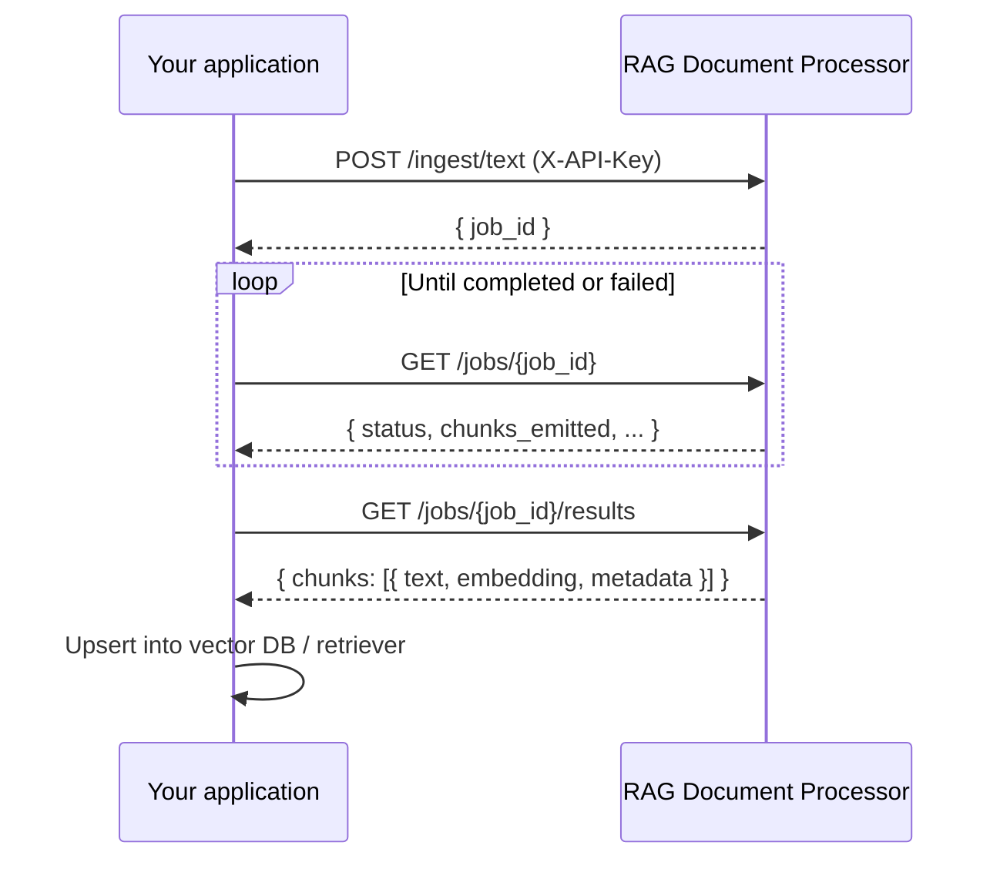

# RAG Document Processor — API integration guide

This document is for **teams building other applications** that need to ingest documents and receive embedded text chunks (vectors + metadata) for retrieval-augmented generation (RAG).

You do **not** need access to Redis, Postgres, or Celery. All interaction is over **HTTPS + JSON** (and multipart for file upload).

---

## What this service does

1. You submit a **file**, **URL**, or **raw text**.
2. The service extracts text, splits it into chunks, and generates **embedding vectors**.
3. You **poll job status**, then **fetch results** via the API.
4. Your app loads the chunks into your own vector store / retriever.

Processing is **asynchronous**: submit returns immediately with a `job_id`; a background worker does the heavy work.

---

## Base URL

| Environment | Base URL |
|-------------|----------|
| **Local dev** | `http://127.0.0.1:8000` |
| **Cloud Run (staging/prod)** | `https://….run.app` — HTTPS URL from your operator (no port) |

All routes below are prefixed with **`/api/v1`**.

Interactive OpenAPI docs (when the server is running):

- Swagger UI: `{BASE_URL}/docs`
- OpenAPI JSON: `{BASE_URL}/openapi.json`

---

## Authentication

### Client API key (required for ingest & jobs)

Every ingest and job request must include:

```http
X-API-Key: rag_<your-secret-key>
```

- Keys look like `rag_…` (URL-safe random string).
- Keys are **issued by the service operator** — not self-registered by integrators.
- Store the key in your app's secrets (env var, Secret Manager, etc.). **Never** commit it to git or expose it in browser frontends.
- If a key is compromised, ask the operator to revoke it and issue a new one.

### Admin secret (operators only)

Creating or revoking API keys uses a separate **`X-Admin-Secret`** header. Integrating applications **do not** need this — your operator manages keys.

---

## Typical integration flow



### Recommended polling

- Poll `GET /jobs/{job_id}` every **1–3 seconds** for small jobs, or **5–10 seconds** for large PDFs.
- Stop when `status` is `completed` or `failed`.
- Then call `GET /jobs/{job_id}/results`.
- If results return **409** `job_results_not_ready`, keep polling status and retry.

---

## Endpoints summary

| Method | Path | Auth | Purpose |
|--------|------|------|---------|
| `GET` | `/api/v1/health` | None | Liveness check |
| `POST` | `/api/v1/ingest/file` | `X-API-Key` | Upload PDF, DOCX, TXT, MD |
| `POST` | `/api/v1/ingest/url` | `X-API-Key` | Ingest from HTTPS URL |
| `POST` | `/api/v1/ingest/text` | `X-API-Key` | Ingest raw text segments |
| `GET` | `/api/v1/jobs/{job_id}` | `X-API-Key` | Poll job status |
| `GET` | `/api/v1/jobs/{job_id}/results` | `X-API-Key` | Fetch all chunks + embeddings |
| `GET` | `/api/v1/embeddings/dimension-constraints` | None | Allowed embedding sizes by model |

---

## 1. Health check

```http
GET /api/v1/health
```

**Response (200):**

```json
{ "status": "ok" }
```

Use this for load balancers and startup probes on GCP.

---

## 2. Submit ingestion

### Option A — Text (JSON)

Best for content you already have in memory.

```http
POST /api/v1/ingest/text
Content-Type: application/json
X-API-Key: rag_...
```

```json
{
  "texts": [
    "First paragraph or document section.",
    "Optional second segment (joined with blank lines)."
  ],
  "embedding_pipeline": "chunk_then_embed",
  "macro_splitter": "recursive",
  "embedder_provider": "openai",
  "embedding_model": "text-embedding-3-small",
  "embedding_dimensions": 1536,
  "llama_parse_tier": "agentic"
}
```

Only `texts` is required; omit any optional field to use server defaults. See **Request & response enumerations** below for all allowed values.

**Response (200):**

```json
{
  "job_id": "550e8400-e29b-41d4-a716-446655440000"
}
```

### Option B — File (multipart)

Supported types (server default): PDF, plain text, markdown, DOCX.

```http
POST /api/v1/ingest/file
Content-Type: multipart/form-data
X-API-Key: rag_...
```

Form fields:

| Field | Required | Description |
|-------|----------|-------------|
| `file` | Yes | The document bytes |
| `embedding_model` | No | Override embedding model id |
| `embedding_dimensions` | No | Output vector size (must fit model) |
| `embedding_pipeline` | No | `chunk_then_embed` or `late_chunking` |
| `macro_splitter` | No | `recursive`, `semantic`, or `token_aware` |
| `embedder_provider` | No | `openai` or `jina` |
| `llama_parse_tier` | No | PDF/DOCX parse tier: `fast`, `cost_effective`, `agentic`, `agentic_plus` |

**curl example:**

```bash
curl -X POST "$BASE_URL/api/v1/ingest/file" \
  -H "X-API-Key: $RAG_API_KEY" \
  -F "file=@./document.pdf"
```

### Option C — URL (JSON)

Fetches a document from HTTPS (e.g. hosted PDF).

```http
POST /api/v1/ingest/url
Content-Type: application/json
X-API-Key: rag_...
```

```json
{
  "url": "https://example.com/report.pdf"
}
```

Same optional fields as text ingest (`embedding_model`, `embedding_dimensions`, etc.).

### Optional ingest parameters

Omit any optional field to use the **deployment defaults** configured by the operator.

Before sending a custom `embedding_dimensions`, check allowed ranges:

```http
GET /api/v1/embeddings/dimension-constraints
```

Invalid combinations return **422** with `code: invalid_embedding_dimensions` and allowed min/max in the body.

### Request & response enumerations (complete reference)

All optional ingest fields below apply to **`POST /ingest/text`**, **`POST /ingest/url`**, and **`POST /ingest/file`** (multipart form field names match the JSON keys).

| Field | Required | Type | Allowed values / notes |
|-------|----------|------|------------------------|
| `texts` | Yes (text only) | `string[]` | Non-empty strings; joined with blank lines |
| `url` | Yes (url only) | `string` (HTTPS URL) | Must be a valid `http://` or `https://` URL |
| `file` | Yes (file only) | binary | See allowed content types below |
| `embedding_pipeline` | No | enum | **`chunk_then_embed`**, **`late_chunking`** |
| `macro_splitter` | No | enum | **`recursive`**, **`semantic`**, **`token_aware`** |
| `embedder_provider` | No | enum | **`openai`**, **`jina`** — only for `chunk_then_embed`; ignored when pipeline is `late_chunking` |
| `llama_parse_tier` | No | enum | **`fast`**, **`cost_effective`**, **`agentic`**, **`agentic_plus`** — PDF/DOCX parsing only |
| `embedding_model` | No | string | Provider model id (not an enum). Examples: `text-embedding-3-small`, `text-embedding-3-large`, `jina-embeddings-v3`. Omit to use server defaults. |
| `embedding_dimensions` | No | integer | **Not a fixed enum** — valid range depends on `embedding_model`. Request accepts `1`–`16384`; server validates against model. Use `GET /embeddings/dimension-constraints` for min/max per model family. |

**Cross-field rules (validation):**

| Rule | Detail |
|------|--------|
| `late_chunking` | Always uses **Jina**. `embedder_provider=openai` → **422**. Server must have `JINA_API_KEY`. |
| `chunk_then_embed` | `embedder_provider` optional; if omitted, server picks OpenAI when configured, else Jina. |
| `embedding_model` | Applied to whichever provider the job resolves to (OpenAI or Jina). |
| `semantic` splitter | Requires OpenAI embeddings on the server (used internally for semantic chunking). |

**Response-only enums** (job status / results):

| Field | Values |
|-------|--------|
| `status` | **`pending`**, **`processing`**, **`completed`**, **`failed`** |
| `source_kind` | **`file`**, **`url`**, **`text`** |

**Allowed file content types** (default server config; operator may change):

| MIME type | Extensions (typical) |
|-----------|----------------------|
| `application/pdf` | `.pdf` |
| `text/plain` | `.txt` |
| `text/markdown` | `.md` |
| `application/vnd.openxmlformats-officedocument.wordprocessingml.document` | `.docx` |

URL ingest accepts the same types after fetch (plus `text/plain` / `text/markdown` when detected).

**`embedding_dimensions` by model** — use the live catalog (not a static enum):

```http
GET /api/v1/embeddings/dimension-constraints
```

Example rules (subject to server version):

| Provider | Example model | Min | Max |
|----------|---------------|-----|-----|
| OpenAI | `text-embedding-3-small` | 256 | 1536 |
| OpenAI | `text-embedding-3-large` | 256 | 3072 |
| Jina | `jina-embeddings-v3` | 256 | 1024 |

Always prefer the API response over this table when choosing dimensions.

### Upload limits

- Default max upload size: **20 MB** (operator-configurable).
- Oversized uploads: **413** `payload_too_large`.
- Unsupported MIME type: **415** `unsupported_media_type`.

---

## 3. Poll job status

```http
GET /api/v1/jobs/{job_id}
X-API-Key: rag_...
```

**Response (200):**

```json
{
  "job_id": "550e8400-e29b-41d4-a716-446655440000",
  "status": "processing",
  "source_kind": "text",
  "chunks_emitted": 0,
  "error_message": null,
  "llama_parse_tier": "cost_effective",
  "embedding_dimensions": 1536,
  "embedding_pipeline": "chunk_then_embed",
  "macro_splitter": "recursive",
  "embedder_provider": "openai",
  "embedding_model": "text-embedding-3-small",
  "created_at": "2026-06-06T12:00:00+00:00",
  "updated_at": "2026-06-06T12:00:05+00:00"
}
```

### Job status values

| `status` | Meaning |
|----------|---------|
| `pending` | Queued, not started |
| `processing` | Worker is extracting / embedding |
| `completed` | Success — fetch results |
| `failed` | Error — see `error_message`; results may be empty |

---

## 4. Fetch ingestion results

```http
GET /api/v1/jobs/{job_id}/results
X-API-Key: rag_...
```

Call this **after** status is `completed` or `failed`.

**Response (200):**

```json
{
  "job_id": "550e8400-e29b-41d4-a716-446655440000",
  "status": "completed",
  "source_kind": "text",
  "chunks_emitted": 2,
  "error_message": null,
  "embedding_dimensions": 1536,
  "embedding_model": "text-embedding-3-small",
  "chunks": [
    {
      "index": 0,
      "text": "First chunk of extracted text.",
      "embedding": [0.012, -0.034, "..."],
      "metadata": {
        "job_id": "550e8400-e29b-41d4-a716-446655440000",
        "source_kind": "text",
        "embedding_pipeline": "chunk_then_embed",
        "macro_splitter": "recursive",
        "embedder": "openai"
      }
    }
  ],
  "finalization_metadata": {
    "chunks": "2"
  }
}
```

### Using results in your RAG stack

For each item in `chunks`:

| Field | Use in your app |
|-------|-----------------|
| `text` | Document content for display and BM25 / full-text search |
| `embedding` | Vector for similarity search (store in Pinecone, pgvector, Chroma, etc.) |
| `metadata` | Filter facets, traceability (`job_id`, pipeline info) |
| `embedding_dimensions` / `embedding_model` (top-level) | Ensure your index matches vector size and model family |

**Important:** Use the **same embedding model** at query time as was used for ingestion, or retrieval quality will suffer.

---

## Error responses

Errors use a consistent JSON shape:

```json
{
  "detail": "Human-readable message",
  "code": "machine_readable_code"
}
```

| HTTP | `code` | When |
|------|--------|------|
| 401 | — | Missing or invalid `X-API-Key` |
| 404 | `job_not_found` | Unknown `job_id` |
| 409 | `job_results_not_ready` | Results requested while job is still `pending` / `processing` |
| 413 | `payload_too_large` | File or URL body too large |
| 415 | `unsupported_media_type` | File type not allowed |
| 422 | `invalid_embedding_dimensions` | Bad `embedding_dimensions` for model |
| 422 | `invalid_llama_parse_tier` | Unknown parse tier |
| 422 | `invalid_ingest_embedding_options` | Invalid pipeline / splitter / provider combo |

---

## Code examples

### Python (`httpx`)

```python
import os
import time

import httpx

BASE_URL = os.environ["RAG_PROCESSOR_URL"]  # e.g. https://rag-api.example.com
API_KEY = os.environ["RAG_API_KEY"]


def ingest_text_and_wait(texts: list[str], poll_seconds: float = 2.0) -> dict:
    headers = {"X-API-Key": API_KEY}

    with httpx.Client(base_url=BASE_URL, headers=headers, timeout=120.0) as client:
        # 1. Submit
        created = client.post("/api/v1/ingest/text", json={"texts": texts})
        created.raise_for_status()
        job_id = created.json()["job_id"]

        # 2. Poll status
        while True:
            status_resp = client.get(f"/api/v1/jobs/{job_id}")
            status_resp.raise_for_status()
            body = status_resp.json()
            if body["status"] in ("completed", "failed"):
                break
            time.sleep(poll_seconds)

        if body["status"] == "failed":
            raise RuntimeError(body.get("error_message") or "Ingestion failed")

        # 3. Fetch results
        results = client.get(f"/api/v1/jobs/{job_id}/results")
        results.raise_for_status()
        return results.json()


if __name__ == "__main__":
    data = ingest_text_and_wait(["Your document text here."])
    for chunk in data["chunks"]:
        print(chunk["index"], chunk["text"][:80], len(chunk["embedding"]))
```

### JavaScript (fetch)

```javascript
const BASE_URL = process.env.RAG_PROCESSOR_URL;
const API_KEY = process.env.RAG_API_KEY;

async function ingestTextAndWait(texts) {
  const headers = {
    "Content-Type": "application/json",
    "X-API-Key": API_KEY,
  };

  const created = await fetch(`${BASE_URL}/api/v1/ingest/text`, {
    method: "POST",
    headers,
    body: JSON.stringify({ texts }),
  });
  if (!created.ok) throw new Error(await created.text());
  const { job_id } = await created.json();

  let status;
  do {
    await new Promise((r) => setTimeout(r, 2000));
    const res = await fetch(`${BASE_URL}/api/v1/jobs/${job_id}`, { headers });
    status = await res.json();
  } while (!["completed", "failed"].includes(status.status));

  if (status.status === "failed") {
    throw new Error(status.error_message ?? "Ingestion failed");
  }

  const results = await fetch(`${BASE_URL}/api/v1/jobs/${job_id}/results`, { headers });
  return results.json();
}
```

### cURL (quick test)

```bash
export BASE_URL="http://127.0.0.1:8000"
export RAG_API_KEY="rag_your_key_here"

# Submit
JOB=$(curl -s -X POST "$BASE_URL/api/v1/ingest/text" \
  -H "Content-Type: application/json" \
  -H "X-API-Key: $RAG_API_KEY" \
  -d '{"texts":["Hello from integration test"]}' | jq -r .job_id)

# Poll (manual loop in shell)
curl -s "$BASE_URL/api/v1/jobs/$JOB" -H "X-API-Key: $RAG_API_KEY" | jq .

# Results (after completed)
curl -s "$BASE_URL/api/v1/jobs/$JOB/results" -H "X-API-Key: $RAG_API_KEY" | jq .
```

---

## Environment variables for your project

Suggested names for consuming applications:

| Variable | Example | Description |
|----------|---------|-------------|
| `RAG_PROCESSOR_URL` | `https://rag-api.example.com` | Base URL (no trailing slash) |
| `RAG_API_KEY` | `rag_…` | Client API key from operator |

---

## GCP deployment (for integrators)

When the service is deployed on GCP:

- Your operator will share the **public base URL** and an **API key** for your environment (staging vs production).
- Use **`GET /api/v1/health`** for uptime checks.
- Prefer **HTTPS only** in production; do not send API keys over plain HTTP.
- Large file uploads: consider timeout settings on your HTTP client (60–120s+ for big PDFs).
- Rate limits and quotas (if any) will be documented by the platform team when production goes live.

This service does **not** expose Redis or the database to clients — all data retrieval is through **`/jobs/{job_id}/results`**.

---

## Getting an API key

1. Contact the **service operator** / platform team.
2. They create a key labeled for your project (e.g. `"acme-rag-backend"`).
3. You receive the `rag_…` secret **once** — store it securely.
4. To rotate: request a new key, deploy it, then ask the operator to revoke the old key.

---

## Support & discovery

- **OpenAPI / Swagger:** `{BASE_URL}/docs` — full request/response schemas and try-it-out UI.
- **Embedding dimension rules:** `GET /api/v1/embeddings/dimension-constraints`
- **Service operators:** see [ONBOARDING.md](./ONBOARDING.md) and [DEPLOY_CLOUD_RUN.md](./DEPLOY_CLOUD_RUN.md) in this repo.
