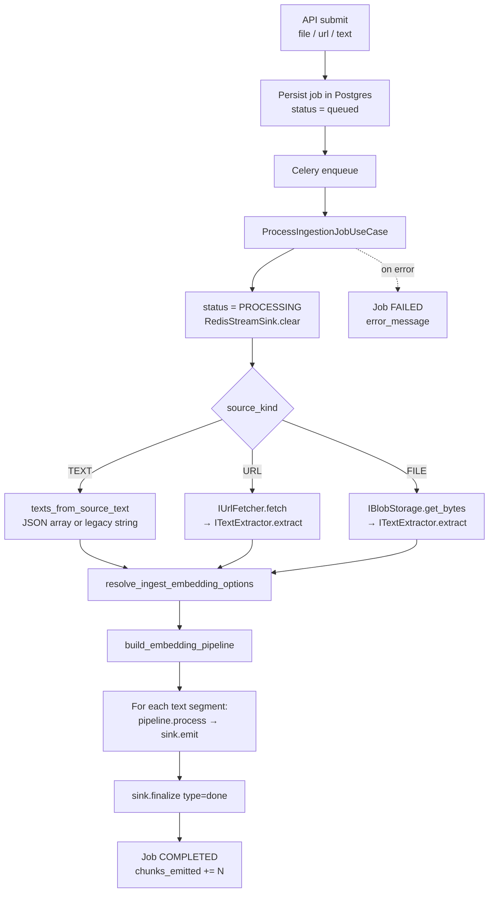
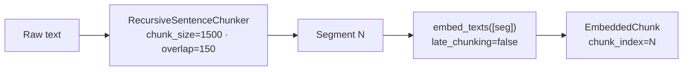
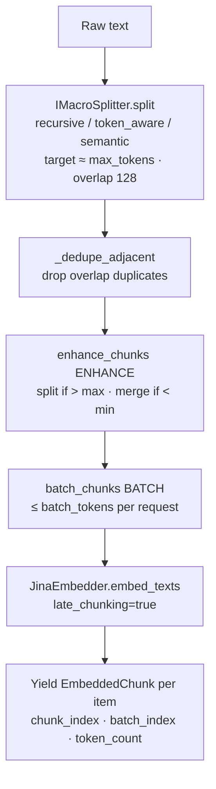
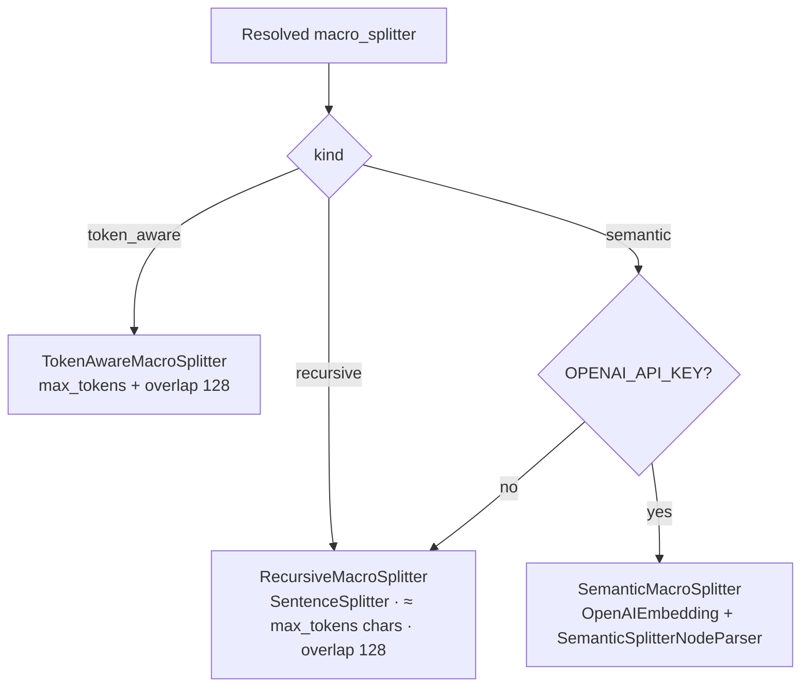
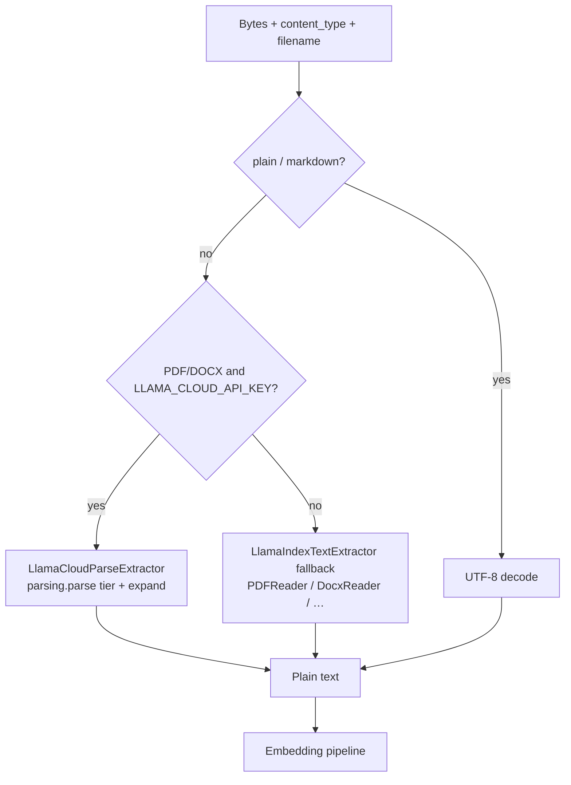
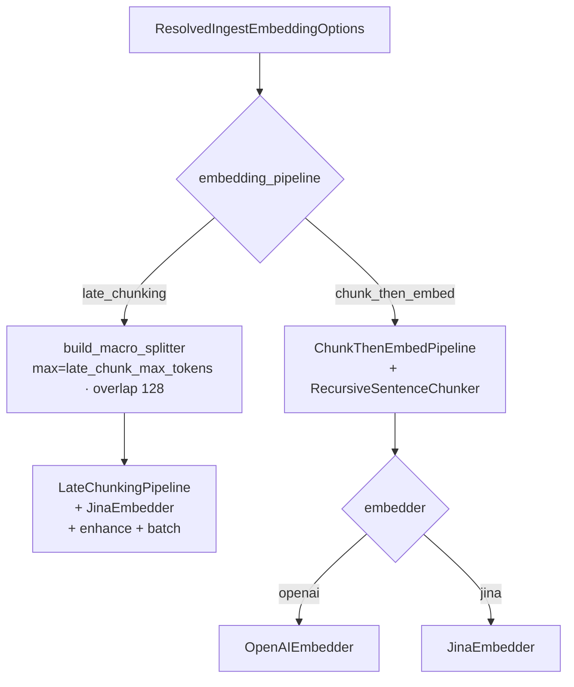

# Pipelines — detailed maps

This document describes every **embedding pipeline**, **macro splitter**, and **extraction** path used by the Celery worker. For an interactive version, open the Cursor canvas `pipeline-diagrams.canvas.tsx` beside chat.

Primary code:

| Area | Path |
|------|------|
| Factory | `core/pipeline_factory.py` |
| Pipelines | `infrastructure/pipelines/embedding_pipelines.py` |
| Late enhance/batch | `infrastructure/pipelines/late_chunk_enhancer.py` |
| Macro splitters | `infrastructure/splitters/macro_splitters.py` |
| Classic chunker | `infrastructure/splitters/sentence_chunker.py` |
| Option resolve | `core/ingest_embedding_options.py` |
| Worker orchestration | `application/use_cases/ingestion/process_job.py` |
| Extraction | `infrastructure/extraction/` |
| Sink | `infrastructure/sinks/redis_stream_sink.py` |

---

## 1. Worker overview (end-to-end)

**Per-chunk Redis fields** (`ingest:{job_id}` stream): `type=chunk`, `text`, `embedding` (JSON array), `metadata` (JSON). Finalize adds `type=done` with `{"chunks": "N"}`.

**Job-level metadata** attached before `process` (and merged onto each chunk):

- Always: `job_id`, `source_kind`, `embedding_pipeline`, `macro_splitter`, `embedder`, `text_index`
- Multi-text ingest: `text_count`
- Late chunking: `late_chunk_min_tokens`, `late_chunk_max_tokens`, `late_chunk_batch_tokens`
- Pipeline adds: `chunk_index`, `pipeline`, optional `embedding_dimensions`; late also `batch_index`, `token_count`

---

## 2. `chunk_then_embed`

**Default** (`EMBEDDING_PIPELINE=chunk_then_embed`). Independent chunk → embed. Supports **OpenAI or Jina**.

| Piece | Detail |
|-------|--------|
| Class | `ChunkThenEmbedPipeline` |
| Chunker | `RecursiveSentenceChunker` (LlamaIndex `SentenceSplitter`) |
| Macro splitter | **Not used** (factory only builds macros for `late_chunking`) |
| Embedder | `OpenAIEmbedder` if `resolved.embedder == "openai"`, else `JinaEmbedder` |
| API pattern | **One embed call per chunk** (sequential `await`) |
| Late-chunk token knobs | Ignored |

**When to use:** OpenAI-only stacks; simple RAG; predictable overlapping windows; lowest operational complexity.

---

## 3. `late_chunking`

**Jina-only.** Full text → **macro splitter** produces chunk text (recursive / token_aware / semantic, with small overlap) → **ENHANCE** enforces `min_tokens`..`max_tokens` → **BATCH** packs under the Jina request budget → one `late_chunking=true` embed call per batch.

### 3.1 Macro split (chunk text)

Each macro splitter yields **chunk candidates** sized near `late_chunk_max_tokens` (default 512), with **128-token overlap** between consecutive chunks (deduped before enhance):

| Splitter | Mechanism |
|----------|-----------|
| `recursive` | LlamaIndex `SentenceSplitter`; char budget ≈ `max_tokens × 4` |
| `token_aware` | tiktoken sliding window; `max_tokens` + 128 overlap |
| `semantic` | OpenAI embedding breakpoints (topic shifts); variable size → enhance normalizes |

### 3.2 ENHANCE (`enhance_chunks`)

Normalizes macro output to `min_tokens`..`max_tokens`:

1. **Sub-split** any macro chunk above `max_tokens` (sentence-aware).
2. **Dedupe** consecutive duplicates from macro overlap.
3. **Merge** adjacent fragments below `min_tokens` while staying ≤ `max_tokens`.

Tokens counted via `make_token_counter()` (tiktoken `gpt-4o-mini` / `cl100k_base`).

### 3.3 BATCH (`batch_chunks`) → Jina

Pack enhanced chunks so total tokens ≤ `LATE_CHUNK_BATCH_TOKENS` (default **7000**).

- **Each batch = one** `POST https://api.jina.ai/v1/embeddings` with `late_chunking=true` and `input = [chunk strings in that batch]`.
- Chunks in the **same** batch share late-chunking context; chunks in **different** batches do not.
- Oversized single chunks get their own batch (still one API call).
- Batching is a **client-side** budget to stay under the model context window (e.g. ~8K for `jina-embeddings-v3`); Jina does not require a fixed batch count.

### 3.4 Defaults and overrides

| Knob | Env default | Per-job override? |
|------|-------------|-------------------|
| `late_chunk_min_tokens` | `LATE_CHUNK_MIN_TOKENS` = 256 | Yes |
| `late_chunk_max_tokens` | `LATE_CHUNK_MAX_TOKENS` = 512 | Yes (also sizes recursive / token_aware macro windows) |
| `late_chunk_batch_tokens` | `LATE_CHUNK_BATCH_TOKENS` = 7000 | No (env only) |
| Macro overlap | 128 tokens | Fixed in factory (`DEFAULT_MACRO_OVERLAP_TOKENS`) |

**Hard rules at resolve:** `embedder_provider=openai` → **422**; `JINA_API_KEY` required; `1 ≤ min ≤ max ≤ 8192`.

**When to use:** Context-aware embeddings; fewer denser RAG chunks (raise min/max); Jina is available.

---

## 4. Macro splitters (late_chunking only)

Factory: `build_macro_splitter(settings, macro, max_tokens=late_chunk_max_tokens, overlap_tokens=128)`.

| Name | Mechanism | Notes |
|------|-----------|--------|
| `recursive` | LlamaIndex `SentenceSplitter` sized from `late_chunk_max_tokens` | **Default**; also silent fallback for semantic without key |
| `token_aware` | Sliding tiktoken window | `max_tokens = late_chunk_max_tokens`, overlap 128 |
| `semantic` | `SemanticSplitterNodeParser` + `text-embedding-3-small` | Topic-based breaks; enhance enforces min/max after |

Overlap from recursive/token windows can produce duplicate adjacent chunks; late pipeline removes them with `_dedupe_adjacent` before enhance.

---

## 5. Extraction (upstream of both pipelines)

| Tier | `expand` | Notes |
|------|----------|--------|
| `fast` | `["text"]` | Markdown expand rejected by LlamaCloud |
| `cost_effective` / `agentic` / `agentic_plus` | `["markdown","text"]` | Prefer markdown pages (+ header/footer) |

Per-job `llama_parse_tier` overrides `LLAMA_PARSE_TIER` (default `agentic`).

---

## 6. Factory decision tree

---

## 7. Choose quickly

| Need | Prefer |
|------|--------|
| OpenAI embeddings only | `chunk_then_embed` |
| Shared context inside vectors | `late_chunking` |
| Fewer denser chunks | `late_chunking` + raise `late_chunk_min/max_tokens` |
| Hard token window on long docs | `late_chunking` + `macro_splitter=token_aware` |
| Topic-ish macro breaks | `late_chunking` + `macro_splitter=semantic` (+ OpenAI key) |
| Simplest default | `chunk_then_embed` |

Client-facing field reference: [API_INTEGRATION.md](./API_INTEGRATION.md). Onboarding overview: [ONBOARDING.md](./ONBOARDING.md).
